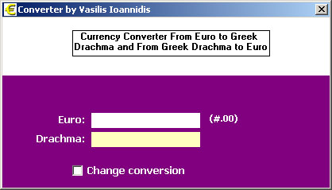



## Euro\-2\-Drh

### Description

It's a very simple but efficient Euro converter from Greek Drachma to Euro and vice-versa... can easily be changed to any local currency.
 
### More Info
 

             |
---                |---
**Submitted On**   |2002-01-08 10:44:22
**By**             |[Vasilis Ioannidis](https://github.com/Planet-Source-Code/PSCIndex/blob/master/ByAuthor/vasilis-ioannidis.md)
**Level**          |Beginner
**User Rating**    |5.0 (10 globes from 2 users)
**Compatibility**  |VB 6\.0
**Category**       |[Math/ Dates](https://github.com/Planet-Source-Code/PSCIndex/blob/master/ByCategory/math-dates__1-37.md)
**World**          |[Visual Basic](https://github.com/Planet-Source-Code/PSCIndex/blob/master/ByWorld/visual-basic.md)
**Archive File**   |[Euro\-2\-Drh47152182002\.zip](https://github.com/Planet-Source-Code/vasilis-ioannidis-euro-2-drh__1-30554/archive/master.zip)

